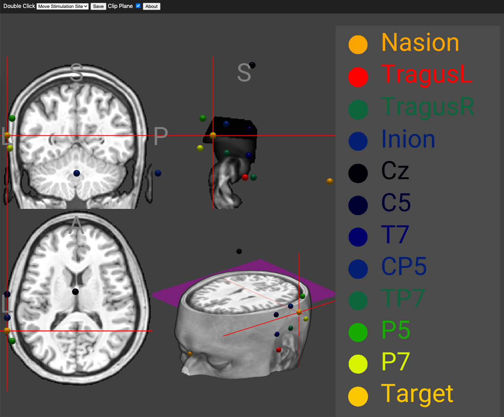

# NiiNav

NiiNav is a tool for estimating scalp coordinates, such as those in the [10–20 EEG system](https://en.wikipedia.org/wiki/10%E2%80%9320_system_(EEG)), relative to MRI scans. This can be particularly useful for visualizing electrode positions for brain stimulation in scientific and clinical research.

Recent research, including studies from [our team](https://pubmed.ncbi.nlm.nih.gov/30128538/), has shown that brain stimulation can support recovery from stroke (source). In prior work, we used functional MRI (fMRI) to identify optimal locations for brain stimulation. However, fMRI can be challenging for individuals with aphasia due to its acquisition requirements and signal variability.

NiiNav addresses these limitations by allowing researchers to approximate brain stimulation sites using a standard anatomical MRI scan instead of fMRI. Although the effects of brain stimulation are broad and do not require high spatial precision, this tool helps ensure that stimulation targets healthy cortical areas. Since the stimulation effects are very broad, we do not need high spatial precision, but we do want to make sure that the stimulation is over healthy cortex. Therefore, this tool uses a simple anatomical scan to visualize brain injury and electrode positions.

### Live Demo

Try out [this repository in a live demo](https://neurolabusc.github.io/niinav/)

Using this tool is simple:

 1. Drag and drop an anatomical scan (in NIfTI format) onto the live demo web page. 
  - If your image is in DICOM format, you can convert it to NIfTI with [this web page](https://niivue.github.io/niivue-dcm2niix/).
  - If you do not have an image, you can use the default image provided with the web page.
 2. Adjust the position of the [fiducial locations](https://eeglab.org/tutorials/ConceptsGuide/coordinateSystem.html) by double-clicking on the rendering.
 3. Once you are happy with the position of the fiducial markers (nasion, inion and helix-tragus junctions), uses the "Double Click" pull-down menu to switch to "Move Stimulation Site" - the position of a few standard electrodes as well as a suggested brain stimulation target are shown.
 4. At the stage, you can double-click to adjust the position of the "Target" node. You can use the "clip plane" check box to show or hide a clipping plane to visualize brain injury.
 5. These coordinates can be copied to a 10-20 swimming cap.
 6. You can press the "Save" button to save the scene.



### Compiling

You can host your own instance locally, allowing you to extend this distribution.

```
git clone https://github.com/neurolabusc/niinav
cd niinav
npm install
npm run dev
```

### Links

 - NiiNav uses [NiiVue](https://github.com/niivue/niivue) for visualization.
 - NiiNav uses [niimath WebAssembly](https://github.com/niivue/niivue-niimath) as described in [this article](https://apertureneuro.org/article/94384-niimath-and-fslmaths-replication-as-a-method-to-enhance-popular-neuroimaging-tools).
